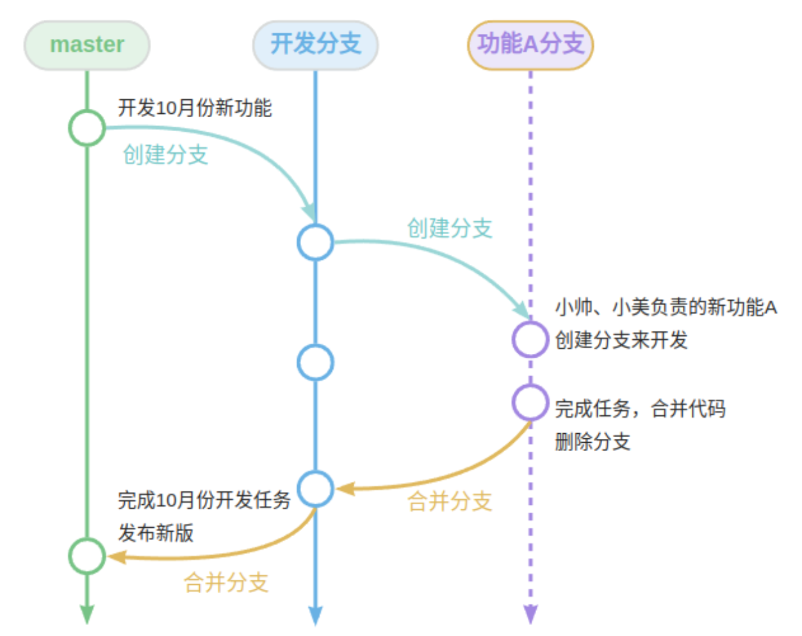
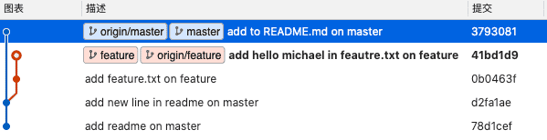
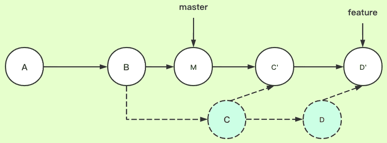
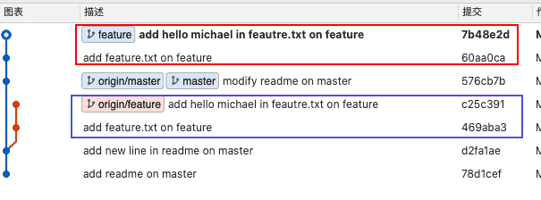
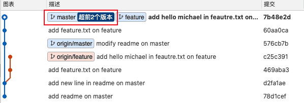
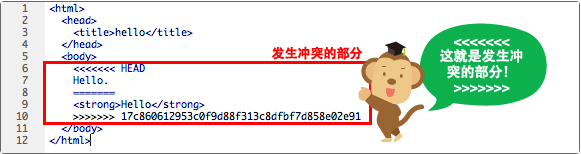
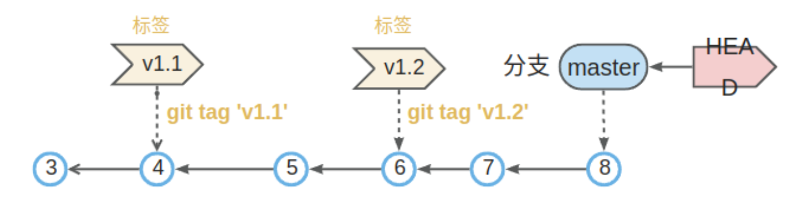

# 分支操作  

分支是从某一个提交节点分离出去的“副本”，分支可以独立开发、独立提交、回滚等操作，也可以和其它分支合并。分支就是指向某一个提交记录的“指针”引用，因此对分支的操作非常的快，不管仓库多大。创建一个分支，实际上就是在 `.git/refs/heads` 下创建一个分支名的引用文件（没有扩展名）。

## 分支的使用

比如你们项目团队准备 10 月份发布新版本，要新开发一堆黑科技功能，占领市场。你和你的小伙伴（小咪）一起负责开发一个新的功能 A，开发周期为 2 周，这两周你们的代码不能影响其他人（不影响主分支）。这个时候可以为这个新功能创建一个分支，你们两个在这个分支上干活，2 周后代码开发完成、测试通过，就看将此分支合并到主分支上。安全、高效，不影响其他人工作，简直是完美。



在实际项目中，一般会有以下几个分支：

- **`master`**：永远保持稳定和可发布的状态，每次发布一个新的版本时，都会从 `dev` 分支合并到 `master` 分支，不允许随便修改和合并
- **`dev`**：作为团队开发的主分支，代表了最新的开发进度，功能分支、发布分支和修复分支都从这里分支出去，最终合并回这里
- **`feature`**：开发人员根据自己的功能模块，创建一些临时分支用于特定功能的开发，开发完毕后在合并到主开发分支，并删除该分支，命名规范：`feature/feature-name`
- **`release`**：从 `dev` 分支创建，进行最后的测试和修复，然后合并回 `dev` 和 `master` 分支，并打上版本标签，命名规范：`release/release-name`
- **`hotfix`**：从 `master` 分支创建，用于修复紧急问题，修复完成后合并回 `master` 和 `develop` 分支，并打上版本标签，命名规范：`hotfix/hotfix-name`


## 操作命令

| 指令 | 描述 |
| --- | --- |
| `git branch` | 列出所有本地分支，加参数 `-v` 显示详细列表，下同 |
| `git branch -r` | 列出所有远程分支 |
| `git branch -a` | 列出所有本地分支和远程分支，用不同颜色区分 |
| `git branch <branch>` | 新建一个分支，但依然停留在当前分支 |
| `git branch -d dev` | 删除 `dev` 分支，`-D`（大写）强制删除 |
| `git checkout -b dev` | 从当前分支创建并切换到 `dev` 分支 |
| `git checkout -b feature1 dev` | 从本地 `dev` 分支代码创建一个 `feature1` 分支，并切换到新分支 |
| `git branch <branch> <commit>` | 新建一个分支，指向指定 `commit id` |
| `git branch --track <branch> <remote-branch>` | 新建一个分支，与指定的远程分支建立关联，使用的前提是之前已经添加过远程仓库，并且对该仓库执行过 `pull` 和 `fetch` 操作 |
| `git checkout -b <branch> <remote-branch>` | 基于远程分支新建本地分支，使用的前提是之前已经添加过远程仓库并已经将远程分支 `pull` 下来，并且对该仓库执行过 `pull` 和 `fetch` 操作 |
| `git branch --set-upstream=<remote-branch> <branch>` | 将现有分支与指定的远程分支之间建立跟踪关联 |
| `git checkout <branch-name>` | 切换到指定分支，并更新工作区 |
| `git checkout .` | 撤销工作区的（未暂存）修改，把暂存区恢复到工作区。 |
| `git checkout HEAD .` | 撤销工作区、暂存区的修改，用 HEAD 指向的当前分支最新版本替换 |
| `git switch master` | 切换到已有的 `master` 分支 |
| `git switch -c <branch_name>` | 创建并切换到新的 `branch_name` 分支 |

!!! note

    - 关于 `checkout` 指令：`checkout` 是 Git 的底层指令，比较常用，也比较危险，他会重写工作区。支持的功能比较多，能撤销修改，能切换分支，这也导致了这个指令比较复杂。在 Git 2.23 版本以后，增加了 `git switch`、`git reset` 指令，对于分支的切换和版本回退更加推荐使用这两个命令。
    - `git switch`：专门用来实现分支切换，创建等操作。
    - `git reset`：专门用来实现版本回退以及撤销修改等操作。

```bash
$ git branch -a
* main
# 列出了当前的所有分支，星号“*”开头的“main”为当前活动分支
```
!!! question "切换分支时，修改操作未提交改怎么办"

    - 如果修改（包括未暂存、已暂存）和待切换的分支没有冲突，则切换成功，且未提交修改会一起带过去，所以要注意。
    - 如果有冲突，切换失败，会提示先 `commit` 或 `stash`。

## `stash`

当你正在 `dev` 分支开发一个功能时，代码写了一半，突然有一个线上的 bug 急需要马上修改。`dev` 分支 bug 没写完，不方便提交，就不能切换到主分支去修复线上 bug。Git 提供一个 `stash` 功能，可以把当前工作区、暂存区未提交的内容“隐藏”起来，就像什么都没发生一样。

```bash
# 有未提交修改，切换分支时报错
$ git switch dev
error: Your local changes to the following files would be overwritten by checkout:
        README.md
Please commit your changes or stash them before you switch branches.
Aborting

# 隐藏
$ git stash
Saved working directory and index state WIP on main: 2bc012c s

# 查看被隐藏的内容
$ git stash list
stash@{0}: WIP on main: 2bc012c s

# 比较一下，什么都没有，一切都没有发生过！
$ git diff

# 去其他分支修改bug，修复完成回到当前分支，恢复工作区
$ git stash pop
```

在上面示例中，有未提交修改，切换分支时报错。错误提示信息很明确了，`commit` 提交或 `stash` 隐藏：`Please commit your changes or stash them before you switch branches.`

!!! warning "注意"

    如果切换分支时，未提交修改的内容没有冲突，是可以成功切换的，未提交修改会被带过去。

| **指令** | **描述** |
| --- | --- |
| `git stash` | 把未提交内容隐藏起来，包括未暂存、已暂存。等以后恢复现场后继续工作 |
| `git stash list` | 查看所有被隐藏的内容列表 |
| `git stash pop` | 恢复被隐藏的内容，同时删除隐藏记录 |
| `git stash save "message"` | 同 `git stash`，可以备注说明 message |
| `git stash apply` | 恢复被隐藏的文件，但是隐藏记录不删除 |
| `git stash drop` | 删除隐藏记录 |

!!! warning

    当然这里先提交到本地也是可以的，只是提交不是一个完整的功能代码，而是残缺的一部分，影响也不大。

## 分支合并

Git 中的分支合并是一个常见的使用场景，如：

- 仓库的 `hotfix` 分支修复完 bug 之后，要汇合到主干分支，这个时候两个分支就需要合并处理
- 远端仓库的分支 A 有其他小伙伴合入了代码，这时候，我们需要和远端仓库的分支 A 进行合并

以上只是列举了分支合并的一些常见场景，关于合并的常用指令是 `merge` 和 `rebase`，这两个指令的使用场景会有所不同。

### `fast-forward` 和 `--no-ff` 的区别

假如有一个场景：有两个分支，`master` 分支和 `feature` 分支。现在，`feautre` 分支需要合并回 `master` 分支。


`fast-forward` 合并方式是条件允许的情况，通过将 `master` 分支的 `HEAD` 位置移动到 `feature` 分支的最新提交点上，这样就实现了快速合并。这种情况，是不会新生成 commit 的。


`--no-ff` 的方式进行合并，master 分支就会新生成一次提交记录。


!!! tip

    如果提交满足时，`merge` 默认采用 `fast-forward` 方式进行合并，除非显示的加上 `--no-ff` 选项；而条件不满足时，`merge` 也是无法使用 `fast-forward` 合并成功。

### `merge` 操作

上面用图解的方式介绍了 `fast-forward` 和 `--no-ff` 的区别。下面，结合实际的代码仓进行合并操作，举几个例子理解一下。

!!! note

    `git merge` 操作是区分上下文的，当前分支始终是目标分支，其他一个或多个分支始终合并到当前分支，需要先切到目标分支上。

#### `fast-forward` 合并

刚刚一直在强调条件允许的时候，`fast-forward` 才能合并成功。条件指的是什么呢 —— 其实指的是源分支和目标分支之间没有分叉（diverge），这种情况才可以进行快速合并。如果是下图中的场景，无法通过 `HEAD` 的快速移动实现分支的合并。


下面进行一个不分叉的场景的示例：


现在需要将 `feature` 分支合入到 `master` 分支，默认使用 `fast-forward` 方式：

```bash
# 切到目标分支
git switch master
git merge feature
```

命令行里显示了 `Fast-forward` 的提示：


看一眼 `master` 分支合入的前后对比（注意 `HEAD` 的位置）：


#### `--no-ff` 合并

不分叉的场景是否可以强制采用 `--no-ff` 方式合并 —— 可以。

```bash
# master 回到合入前的状态
git reset --hard d2fa1ae
git merge feature --no-ff
```


这次命令行没有 `Fast-forward` 的提示了。看一眼 `master` 分支图：


这个图和上面讲解 `--no-ff` 命令时的示意图一致，果然会有新 commit 生成。

#### 分叉场景合并



上面的图展示了我们经常遇到的一个场景，`feature` 分支创建之后，源分支也会有新的提交。这就是形成分叉了。这时候如果我们进行合并呢？

```bash
git merge feautre
```


可以看到，虽然默认会尝试 `fast-forward` 的方式进行合并，但是因为分叉了，所以此时会采用 `--no-ff` 的方式进行合并，有新的 commit 生成了。

!!! info

    `fast-forward` 方式对应的合并参数是 `--ff`

我们试试这个参数 `--ff-only`，顾名思义，就是强制只使用 `--ff` 方式进行合并：

```bash
# 回到合并前
git reset --hard 3793081
git merge feature --ff-only
```


经过测试，当分叉时，因为无法使用 `--ff` 方式合并，即使你强制指定使用该方式合并也不行，会提示终止。附上 Git 官方文档中的解释，方便理解：

```txt
With --ff, when possible resolve the merge as a fast-forward (only update the branch pointer to match the merged branch; do not create a merge commit). When not possible (when the merged-in history is not a descendant of the current history), create a merge commit.
```

### `rebase` 操作

`rebase` 命令是一个经常听到，但是大多数人掌握又不太好的一个命令。`rebase` 合并往往又被称为「变基」，「基」的理解很重要，理解了它，其实 `rebase` 命令你就掌握了。

我的描述可能并不准确，只是为了能够帮助你理解。「变基」就是改变当前分支的起点（在某一个提交记录创建此分支，这个提交记录就是此分支的起点）。注意，是当前分支，`rebase` 命令后面紧接着的就是「基分支」。

变基前：


`git reabse master` 变基后：



#### 变基提交示例

我们接下来进行实际的测试，将代码库状态构造成分叉的状态，状态图如下：


以 `master` 分支为基，对 `feautre` 分支进行变基：

```bash
git switch feature
git rebase master
```

以上两行命令，其实可以简写为：`git rebase master feature`

> 特性分支 `feature` 向前移植到了 `master` 分支。经常使用 `git rebase` 操作把本地开发分支移植到远端的 `origin/<branch>` 追踪分支上。也就是经常说的，「把你的补丁变基到 xxx 分支的头」



可以发现，在 `master` 分支的最新节点（576cb7b）后面多了 2 个提交（生成了新的提交记录，仅仅提交信息保持一致），而这两个提交内容就是来自变基前 `feature` 分支，`feature` 分支的提交历史发生了改变。

观察上图还可以发现，变基后，改变的只是 `feature` 分支，基分支（`master` 分支）的 `HEAD` 指针依然在之前的 commit（576cb7b）处。这时候要将 `feature` 分支合入到 `master` 分支上，就满足 `fast-forward` 的条件了，`master` 分支执行快速合并，将 `HEAD` 指针指向刚刚最新合入的提交点。

```bash
git switch master
git merge feature
```


看下图 `master` 分支图，观察 `HEAD` 指针的位置：



!!! note

    上述的情况是在 `rebase` 后没有发生冲突的情况，如果发生冲突，还需要先解决冲突，然后再将解决后的修改提交到仓库，再次执行 `git rebase continue` 指令完成 `rebase`，之后的操作就和上面一样了。

`rebase` 变基操作最适合的是本地分支和远端对应跟踪分支之间的合并。这样理解可能会更清晰一点。比如，远端仓库里有一个特性分支 `feature`，除了你开发之外，还有其他人往这个分支进行合入。当你每次准备提交到远端之前，其实可以尝试变基，这时候基分支就是远端的追踪分支。

下图是仓库的分支图：


```bash
git fetch
git rebase origin/feature feature
```


观察上图，我们本地的提交以远端分支的最新提交为「基」，将差异提交重新进行了提交！远端分支的提交记录依然是一条直线。如果分叉的情况，不采用这种「变基操作」，而直接采用 `merge` 的方式合并，就会有如下这种分支提交图：


因为分叉了，采用 `git pull` 时也没法 `fast-forward` 合并，只能采用 `--no-ff` 方式合并，最后的提交历史就会像上图那样。会产生一个合并提交。同时，分支图也显得稍微杂乱了一点，因为 `feature` 分支不是一条直线了。但是，其实也有好处，可以实际的看出来合并的提交历史。该选择哪个，往往取决于团队的选择策略。

#### `rebase` 总结

`rebase` 命令其实关键在于理解「基」，`git rebase <基分支>`，就是将当前基分支与当前分支的差异提交获取到，然后在「基分支」最新提交点后面将差异提交逐个再次提交，最后将当前分支的 `HEAD` 指针指向最新的提交点。「基分支」的 `HEAD` 位置是不变的。要想完成分支合并，完成变基之后，需要再进行分支间的合并等操作。

`rebase` 命令的用法也不止于此，这里只是做一个简单的介绍进行理解。是否需要 `rebase`，一般根据公司的情况和使用场景来，更多的还是使用 `merge` 来合并分支，可以通过历史提交记录查看每个时间节点干了什么以及先后顺序。

### 冲突处理

冲突一般都是发生在分支合并时，两个分支对同一个地方进行了修改。因此，在有冲突的文件中，都会有标志性的标识来表示冲突的地方。



`<<<<<<< HEAD` 开头的内容就表示是有冲突的部分，需要人工处理，可以借助一些第三方的对比工具。人工处理完毕后，完成合并提交，才最终完成此次合并。`<<<<<<<` 和 `=======` 之间的所有内容都是当前分支的修改，`=======` 和 `>>>>>>>` 之间的内容是另一个分支或远程仓库中的修改。

如下图所示，修正所有冲突的地方之后，执行提交。


## 标签管理

标签（Tags）指的是某个分支某个特定时间点的状态，是对某一个提交记录的的固定“指针”引用。一经创建，不可移动，存储在工作区根目录下 `.git\refs\tags`。可以理解为某一次提交（编号）的别名，常用来标记版本。所以发布时，一般都会打一个版本标签，作为该版本的快照，指向对应提交 `commit`。

当项目达到一个关键节点，希望永远记住那个特别的提交快照，你可以使用 `git tag` 给它打上标签。比如我们今天终于完成了 `V1.1` 版本的开发、测试，并成功上线了，那就可给今天最后这个提交打一个标签 `V1.1`，便于版本管理。

默认标签是打在最新提交的 `commit` 上的，如果希望在指定的提交上打标签则带上提交编号（commit id）：`git tag v0.9 f52c633`



| **指令** | **描述** |
| --- | --- |
| `git tag` | 查看标签列表 |
| `git tag -l 'a*'` | 查看名称是“a”开头的标签列表，带查询参数 |
| `git show <tagname>` | 查看标签信息 |
| `git tag <tagname>` | 创建一个标签，默认标签是打在最新提交的 commit 上的 |
| `git tag <tagname> <commit_id>` | 新建一个 tag 在指定 commit 上 |
| `git tag -a v5.1 -m'v5.1版本'` | 创建标签 v5.1.1039，`-a` 指定标签名，`-m` 指定说明文字 |
| `git tag -d <tagname>` | 删除本地标签 |
| `git checkout v5.1.1039` | 切换标签，同切换分支 |
| `git push <remote> v5.1` | 推送标签，标签不会默认随代码推送推送到服务端 |
| `git push <remote> --tags` | 提交所有 tag |

如果要推送某个标签到远程，使用命令 `git push origin [tagname]`，或者，一次性推送全部到远程：`git push origin --tags`

!!! note

    标签总是和某个 commit 挂钩。如果这个 commit 既出现在 `master` 分支，又出现在 `dev`分支，那么在这两个分支上都可以看到这个标签。

```bash
# tag
$ git tag -a 'v1' -m'v1版本'
$ cat .git/refs/tags/v1
a2e2c9caea35e176cf61e96ad9d5a929cfb82461

# 查看标签列表
$ git tag
v1
```

## `cherry-pick`

出现一个紧急 bug，并在 `dev` 上修复完，此时我们想把在 `dev` 上修复 bug 所做的修改 “复制” 到 `master` 分支，但又不想把整个 `dev` 合并过去。为了方便操作，Git 专门提供了一个 `cherry-pick` 命令，让我们将某一个特定的提交复制到当前分支，不管这个提交在哪个分支。


如上图，操作过程相当于将该提交导出为补丁文件，然后在当前 `HEAD` 上重放，形成无论内容还是提交说明都一致的提交。

- 希望把 `dev` 分支上的 `v7` 提交的内容合并到 `master`，但不需要其他的内容。
- 在 `master` 分支上执行指令 `git cherry-pick v7`，会产生一个新的 `v7` 提交，内容和 `v7` 相同。
- 同时更新 `master`、`HEAD`，以及工作区。

```bash
# 选择连续的提交合入
$ git cherry-pick <start-commit-id>...<end-commit-id>  # 这种写法是左闭右开
$ git cherry-pick <start-commit-id>^...<end-commit-id> # 这种写法是左闭右闭
```
