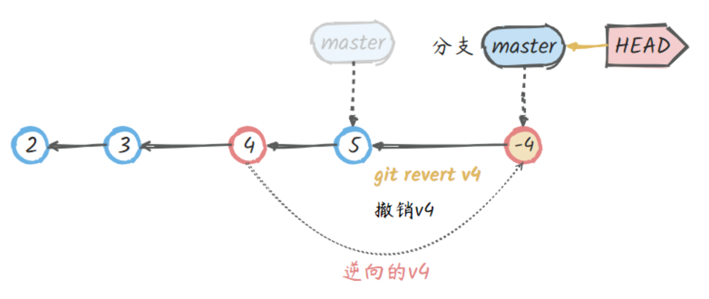

# 查看提交历史

查看 Git 提交历史可以帮助我们了解代码的变更情况和开发进度，Git 提供了多种命令和选项来查看提交历史，从简单的日志到详细的差异对比。除此之外，我们可以回退到任何一个指定的历史记录。

## `git log`

`git log` 是常用的查看 Git 仓库中的历史提交记录，其显示了从最新提交到最早提交的所有提交信息，包括提交的哈希值、作者、提交日期和提交消息等。但是单独 `git log` 显示出的历史提交记录内容较多，查看起来十分麻烦。如下所示：

```bash
$ git log
commit d5e9fc2c811e0ca2b2d28506ef7dc14171a207d9 (HEAD -> master)
Merge: c68142b 7774248
Author: runoob <test@runoob.com>
Date:   Fri May 3 15:55:58 2019 +0800

    Merge branch 'change_site'

commit c68142b562c260c3071754623b08e2657b4c6d5b
Author: runoob <test@runoob.com>
Date:   Fri May 3 15:52:12 2019 +0800

    修改代码

commit 777424832e714cf65d3be79b50a4717aea51ab69 (change_site)
Author: runoob <test@runoob.com>
Date:   Fri May 3 15:49:26 2019 +0800

    changed the runoob.php

commit c1501a244676ff55e7cccac1ecac0e18cbf6cb00
Author: runoob <test@runoob.com>
Date:   Fri May 3 15:35:32 2019 +0800

```

因此，需要添加一些选项进行设置，常用的选项如下：

- `-p`：显示提交的补丁（具体更改内容）
- `--oneline`：以简洁的一行格式显示提交信息
- `--graph`：以图形化方式显示分支和合并历史
- `--decorate`：显示分支和标签指向的提交
- `--author=<作者>`：只显示特定作者的提交
- `--since=<时间>`：只显示指定时间之后的提交
- `--until=<时间>`：只显示指定时间之前的提交
- `--grep=<模式>`：只显示包含指定模式的提交消息
- `--no-merges`：不显示合并提交
- `--stat`：显示简略统计信息，包括修改的文件和行数
- `--abbrev-commit`：使用短提交哈希值
- `--pretty=<格式>`：使用自定义的提交信息显示格式
- `--all`：显示所有分支的提交信息

使用示例如下:

```bash
$ git log --oneline --graph
*   d5e9fc2 (HEAD -> master) Merge branch 'change_site'
|\  
| * 7774248 (change_site) changed the runoob.php
* | c68142b 修改代码
|/  
* c1501a2 removed test.txt、add runoob.php
* 3e92c19 add test.txt
* 3b58100 第一次版本提交
```

这样我们就更清楚明了地看到何时工作分叉、又何时合并。

!!! tip

    如果按照[我推荐的全局配置](./getting_started.md#全局配置推荐)方式进行 Git 配置，那么只需要输出简单的 `git lg --all` 就可以查看所有的历史提交记录。

    ```bash
    $ git lg --all
    *   d5e9fc2 (HEAD -> master) Merge branch 'change_site'
    |\  
    | * 7774248 (change_site) changed the runoob.php
    * | c68142b 修改代码
    |/  
    * c1501a2 removed test.txt、add runoob.php
    * 3e92c19 add test.txt
    * 3b58100 第一次版本提交
    ```

## 恢复和回退

Git 提供了多种方式来恢复和回退到之前的版本，不同的命令适用于不同的场景和需求。有以下几种常见的方式：

- `git checkout`：切换分支或恢复文件到指定提交（能力太多，不推荐使用）
- `git restore`: 恢复文件状态的修改
- `git reset`：重置当前分支到指定提交（`--soft`、`--mixed`、`--hard`）
- `git revert`：创建一个新的提交以撤销指定提交，不改变提交历史
- `git reflog`：查看历史操作记录，找回丢失的提交

这些方式对应的场景是不同的，在指定的场景使用对应的指令即可，这样也不会出错，从而破坏仓库的提交记录信息。通常情况下有四种情况下的回退：已修改未暂存、已暂存未提交、已提交未推送到远程、已推送到远程。


### 已修改未暂存和已暂存未提交

在本地工作区进行了修改，还没有添加到暂存区中（已建立跟踪的 untracked 内容）或者将已修改的文件添加暂存区进行跟踪，都可以使用 `restore` 指令来恢复这些已修改的内容（恢复到前一次提交的内容）。

具体的操作指令如下所示：

| **指令** | **描述** |
| --- | --- |
| `git restore <file>...` | 恢复工作区中未暂存的指定内容（已建立跟踪的，新添加的文件不符合） |
| `git checkout <file>...` | 同上（不推荐） |
| `git checkout <commit-id> <file>` | 同上，但是使用指定的提交记录来覆盖工作区和暂存区的内容（不推荐） |

### 已经 `commit` 尚未 `push`

有时候，我们在本地的修改，可能提交到了本地仓库，但是尚未 `push` 到远程仓库，针对这一种场景的回滚是比较简单的，可以使用 `git reset` 命令来操作。

`reset` 是专门用来撤销修改、回退版本的指令，支持的场景比较多，多种撤销支持，所以参数组合也比较多。简单理解就是移动分支的 `HEAD` 的“指针”地址，理解这一点就基本掌握 `reset` 了。如下图：

- 回退版本 `git reset --hard v4` 或 `git reset --hard HEAD~2`，`master` 的 HEAD 会指向 `v4` 提交，`v5`、`v6` 就被废弃了。
- 也可以重新恢复到 `v6` 版本：`git reset --hard v6`，就是移动 `master`、HEAD 的“指针”地址。


`reset` 有三种模式，对应三种参数：`mixed`(默认模式)、`soft`、`hard`，理解这三个参数的区别很简单：

- `--soft`：将当前提交节点的内容恢复到暂存区，并将 `HEAD` 移动指定的提交节点位置，删除之前所有的提交记录
- `--mixed`：将当前提交节点的内容恢复到暂存区，并将 `HEAD` 移动指定的提交节点位置，删除之前所有的提交记录，此为默认模式，参数可以省略
- `--hard`：直接回退到指定提交记录位置（将 `HEAD` 移动指定的提交节点位置），删除之前所有的提交记录

回退前，用 `git log` 可以查看提交历史，以便确定要回退到哪个版本。要重返未来，可以用 `git reflog` 查看所有 `HEAD` 的移动记录，以便确定要回到未来的哪个版本。

```bash
# 撤销暂存区
$ git reset
Unstaged changes after reset:
M       R.md

# 撤销工作区、暂存区修改
$ git reset --hard HEAD

# 回退版本库到上一个版本，并重置工作区、暂存
$ git reset --hard HEAD~

# 回到原来的版本（恢复上一步的撤销操作），并重置工作区、暂存
$ git reset --hard 5f8b961

# 查看所有历史提交记录
$ git reflog
ccb9937 (HEAD -> main, origin/main, origin/HEAD) HEAD@{0}: commit: 报表新增导入功能
8f61a60 HEAD@{1}: commit: bug：修复报表导出bug
4869ff7 HEAD@{2}: commit: 用户报表模块开发
4b1028c HEAD@{3}: commit: 财务报表模块开发完成
```

### 已经 `push` 到远程仓库中

如果我们的提交已经 `push` 到远程仓库了，此时也要分两种情况，就是其他的同事有没有基于我们的提交做了修改并且已经提交到了远程仓库了，因为此时如果我们回退的话，是会把其它同事的修改也一并回退掉，同时也把 git 的历史记录删掉了，这并不是我们所期望的。

如果没有其它同事基于我们的 `commit` 做修改的话，使用 `git revert` 的方法是比较好的，可能也有人认为为什么不能使用 `git reset` 呢？因为 `git reset` 会删掉 `commit` 记录，所以并不是一种良好的做法。

安全的撤销某一个提交记录，基本原理就是生产一个新的提交，用原提交的逆向操作来完成撤销操作。注意，这不同于 `reset`，`reset` 是回退提交记录，`revert` 只是用于撤销某一次历史提交，操作是比较安全的。



如上图：

- 想撤销 `v4` 的修改，执行 `git revert v4`，会产生一个新的提交 `v-4`，是 `v4` 的逆向操作
- 同时更新 `maser`、`HEAD`“指针”位置，以及工作区内容
- 如果已 `push` 则重新 `push` 即可

```bash
# revert撤销指定的提交，“-m”附加说明
$ git revert 41ea42 -m '撤销对***的修改'
[main 967560f] Revert "123"
                            1 file changed, 1 deletion(-)
```