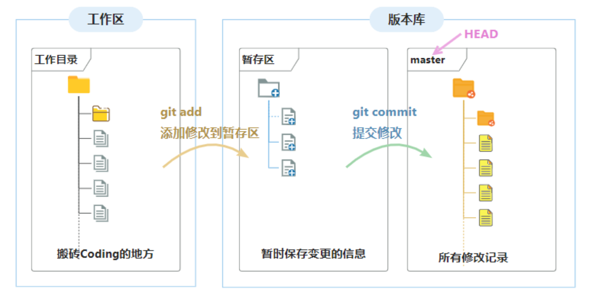
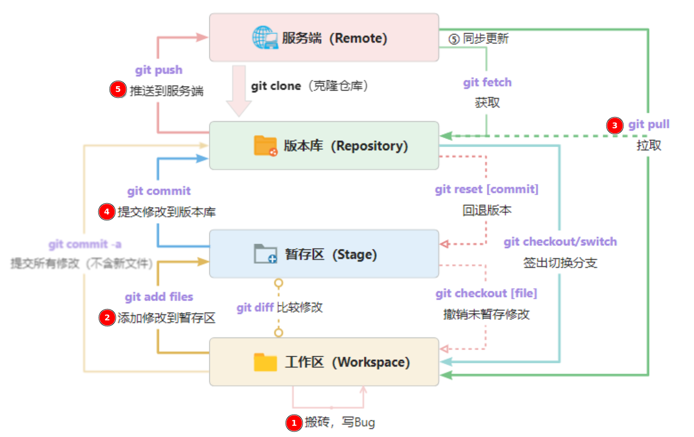

# 使用入门

## Git 配置

### 配置文件

Git 提供了一个叫做 `git config` 的命令，用来配置或读取相应的工作环境变量，这些环境变量，决定了 Git 在各个环节的具体工作方式和行为。

Git 有三个主要的配置文件，分为三个等级，即 `system`、`global` 和 `local`，优先级为: `system` < `global` < `local`。
    
- `system` 是系统级别的配置，被所有用户共享，优先级最低。在 Ubuntu 系统中，`system` 级别配置文件位于 `/etc/gitconfig`，在 Windows 系统中，`system` 级别配置文件位于自己的安装目录。使用 `git config --system` 命令可对 `system` 级配置进行查询和修改。
- `global` 是全局级别的配置，被当前用户所使用。在 Ubuntu 系统中，`global` 级配置文件位于 `${XDG_CONFIG_HOME}/git/config` 或 `~/.gitconfig`（如前者不存在）。如果环境变量 `XDG_CONFIG_HOME` 未设置或为空值，则默认为 `~/.config`。在 Windows 系统中，global 级别配置文件位于 `C:\Users\<system user_name>\.gitconfig`。使用 `git config --global` 命令可对 global 级别配置进行查询和修改。
- `local` 是仅限某一个 Git 仓库的设置，优先级最高，`local` 级别配置文件的路径为 `<REPO_DIR>/.git/config`。使用 `git config --local` 命令（设置 local 级别选项时可省略 `--local`）可对 local 级别配置进行查询和修改。

我们需要配置个人的用户名称和电子邮件地址，为了在每次提交代码时记录提交者的信息，使用如下的命令：

```bash
# 使用 --global 参数选项设置全局配置的用户名称和电子邮件地址
git config --global user.name "JunXu"
git config --global user.email jeffery.xu.cn@outlook.com
```

**仓库配置查询**：仓库里的配置是上面多个配置文件的集合

```bash
$ git config --list
user.name=JunXu
user.email=jeffery.xu.cn@outlook.com
alias.co=checkout
alias.ci=commit
alias.s=status -sb
alias.st=status
alias.br=branch
alias.lg=log --graph --pretty=format:'%C(bold yellow)%h%C(reset) -%C(auto)%d%C(reset) %s %C(bold green)(%ad)%C(reset) %C(bold cyan)[%cn]' --abbrev-commit --date=short
alias.type=cat-file -t
alias.dump=cat-file -p
i18n.logoutputencoding=utf-8
i18n.commitencoding=utf-8
core.autocrlf=false
core.safecrlf=true
core.editor=nvim
http.proxy=http://127.0.0.1:7890
https.proxy=https://127.0.0.1:7890
core.repositoryformatversion=0
core.filemode=false
core.bare=false
core.logallrefupdates=true
core.symlinks=false
core.ignorecase=true
remote.origin.url=git@github.com:xjjeffery/jeffery-learn.git
remote.origin.fetch=+refs/heads/*:refs/remotes/origin/*
branch.master.remote=origin
branch.master.merge=refs/heads/master
```

### 设置代理

在国内 `clone` Github 上的项目可能是出现超时，此时需要设置代理才能成功将项目代码拉到本地。Git 支持 SOCKS/HTTP/HTTPS 代理协议，但与大多数终端应用程序不同，我们无法通过设置 Shell 环境变量 `HTTP_PROXY` 或 `HTTPS_PROXY` 来让 Git 使用代理。正确的方法是通过 Git 配置选项来设定，例如：

```bash
git config --global http.proxy 'socks5://127.0.0.1:7890'
git config --global https.proxy 'socks5://127.0.0.1:7890'
```

### 全局配置（推荐）

此处推荐使用的全局设置（本人常用），为方便操作，对一些常用命令设置了别名，并且规定了换行符在 `checkin/checkout` 时的转换规则。

```ini
[user]
  name = jeffery
  email = jeffery.xu.cn@outlook.com
[alias]
  co = checkout
  ci = commit
  s = status -sb
  st = status
  br = branch
  lg = log --graph --pretty=format:'%C(bold yellow)%h%C(reset) -%C(auto)%d%C(reset) %s %C(bold green)(%ad)%C(reset) %C(bold cyan)[%cn]' --abbrev-commit --date=short
  type = cat-file -t
  dump = cat-file -p
[i18n]
  logOutputEncoding = utf-8
  commitEncoding = utf-8
[core]
  autocrlf = false
  safecrlf = true
  editor = vim
; [url "https://ghproxy.net/https://github.com/"]
;   insteadOf = https://github.com/
[http]
  proxy = http://127.0.0.1:7890
[https]
  proxy = https://127.0.0.1:7890
```

对于篇幅较长或者对排版有要求的提交信息，很难在命令行直接输入，因此需使用文本编辑器进行撰写。`editor` 选项指定了用于撰写提交信息的文本编辑器，可根据喜好自行修改。如果 `editor` 选项未设定，Git 会默认打开由环境变量 `${EDITOR}` 设定的文本编辑器。

配置中的倒数 5、6 行意在使用 `ghproxy.net` 镜像站点来下载 Github 资源。对于任何以 `https://github.com/` 开头的 URL，Git 会自动将其转换成以 `https://ghproxy.net/` 开头的镜像地址。例如，`https://github.com/foo/bar.git` 会被自动转换成 `https://ghproxy.net/https://github.com/foo/bar.git`。ghproxy 会因访问量太大而暂时无法连接，也可能被一些网关屏蔽而完全无法访问，如果你所处的网络环境允许你畅通无阻地访问 Github，又或者你已使用稳定的代理来访问 Github，那么可注释掉该设定。

!!! info

    Git 配置文件使用 `;` 或 `#` 作为注释起始字符。通常，`#` 用于描述性文字，`;` 用于取消选项设定。

    如果需要在 Ubuntu 系统的自带 Terminal 中显示 git 分支信息，可以在 `.bashrc` 文件中添加如下内容：

    ```bash
    parse_git_branch() {
      git branch 2> /dev/null | sed -e '/^[^*]/d' -e 's/* \(.*\)/(\1) /'
    }
    export PS1="$PS1\[\e[91m\]\$(parse_git_branch)\[\e[00m\]\n> "
    ```

## 基本概念

在学习 Git 操作之前，首先了解 Git 中的一些常用的基本概念。

使用 Git 版本管理项目，都要先在项目中初始化一个 Git 仓库，使用命令 `git init`。执行完成 `git init` 命令后，Git 仓库会生成一个 `.git` 目录，该目录包含了资源的所有元数据，其他的项目目录保持不变。或者直接通过 `git clone <remote-repo>` 的方式将一个现有 Git 仓库拷贝到本地中。

在 Git 管理的项目中有以下概念需要提前理解：

- **本地工作区（workspace）**：宿主机中的某一个由 Git 管理的项目目录
- **暂存区（stage 或 index）**：用于临时记录已追踪文件/目录的状态变化和新文件/目录的添加，实际上只是一个文件（`.git/index`），保存待提交的文件列表信息（暂存区保存了将被包括在下一个提交中的更改），所以我们把暂存区有时也叫作索引
- **本地仓库（repository）**：工作区有一个隐藏目录 `.git`，管理本地项目版本的数据库，记录文件/目录状态的地方，包含项目的所有版本历史记录，可以进行提交、回退等操作
- **远程仓库（remote repository）**：服务端的版本仓库，为多人共享提供服务，承担中心服务器的角色，通过 `git push` 指令将本地版本库推送到服务端版本库，简单理解为在一个公共服务器上的仓库
- **分支（branch）**：分支类似一个指针，指向分出时的提交记录。并且可以独立操作而与原分支互不干扰，仓库初始化以后，一般默认主分支为 `master`
- **头（HEAD）**：`HEAD` 类似一个指针，指向仓库当前活动分支的当前所在提交记录（可以在本地提交记录中任意切换）
- **版本号**：是由 40 位 sha1 哈希表示，表示某一次的提交记录
- **标签（tags）**：是某一个版本号的别名，一旦创建标签，就不能改变这个标签的标记版本，只能进行删除操作

### 工作区、暂存区和仓库之间的关系



如上图所示，当对工作区修改（或新增）的文件执行 `git add <files>` 命令时，暂存区的目录树被更新，同时工作区修改（或新增）的文件内容被写入到对象库中的一个新的对象中，而该对象的 ID 被记录在暂存区的文件索引中。当执行 `git commit` 时，暂存区的目录树写到版本库（对象库）中，`master` 分支会做相应的更新，即 `master` 指向的目录树就是提交时暂存区的目录树，同时也更新 `HEAD` 的指向为最新的提交记录。

简单的理解：在工作区中对项目文件或目录进行增删改操作，将这些操作临时放入到暂存区进行管理，可以方式修改操作的失误。再确认修改操作正确后，将暂存临时存放的操作提交到仓库中进行管理，如此就可以在历史提交记录中查看到这一个操作。也可以从历史提交记录中，将某一个提交记录逐步回退到暂存区、工作区。


如上图，为对应本地仓库目录的结构关系：

- `myblogs` 为项目目录，也就是 Git 工作区；
- 项目根目录下隐藏的 `.git` 目录就是 Git 仓库目录了，存放了所有 Git 管理的信息；
- `.git/config` 为该仓库的配置文件，可通过指令修改或直接修改；
- `index` 文件就是存放的是暂存区内容。

## 工作流程

Git 管理项目的工作流程有几个核心的步骤，只有熟悉这些步骤，才能避免在多人协作开始的项目中避免出错：

1. 准备 Git 仓库（`git init` 或 `git clone`）：手动创建或从服务端克隆一个仓库；
2. 编辑：在项目目录中进行添加、修改、删除等操作；
3. 暂存（`git add`）：将需要进行版本管理的文件添加到暂存区；
4. 拉取更新（`git fetch/git pull`）：如果是多人协作开发，一定要在每次提交之前都要拉取更新，确保在提交之前当前的提交节点是最新的；
5. 提交（`git commit`）：将暂存区的文件提交到 Git 仓库，可能会出现冲突，此时需要解决冲突
6. 合并（`git merge`）：解决完冲突后直接合并，此时会有一个新的提交记录产生
7. 推送（`git push`）：将本地仓库推送到远程仓库，同步本地仓库的提交记录。

大致的流程如下图所示：



## `.gitignore`

项目目录中的文件并不是全都需要纳入版本管理，如日志、临时文件、私有配置文件等不需要也不能纳入版本管理，那该怎么办呢？在工作区根目录下创建 `.gitignore` 文件，文件中配置不需要进行版本管理的文件、文件夹。 `.gitignore` 文件本身是被纳入版本管理的，可以共享。有如下规则：

- `#` 符号开头为注释。
- 可以使用 Linux 通配符。
    - 星号（`*`）代表任意多个字符，
    - 问号（`?`）代表一个字符，
    - 方括号（`[abc]`）代表可选字符范围，
    - 大括号（`{string1,string2,...}`）代表可选的字符串等。
- 感叹号（`!`）开头：表示例外规则，将不被忽略。
- 路径分隔符（`/f`）开头：`,` 表示要忽略根目录下的文件f。
- 路径分隔符（`f/`）结尾：`,` 表示要忽略文件夹f下面的所有文件。

```bash
# 为注释
*.txt # 忽略所有“.txt”结尾的文件
!lib.txt # lib.txt除外
/temp # 仅忽略项目根目录下的temp文件,不包括其它目录下的temp，如不包括“src/temp”
build/ # 忽略build/目录下的所有文件
doc/*.txt # 会忽略 doc/notes.txt 但不包括 doc/server/arch.txt
```

!!! note

    各种语言项目的常用 .gitignore 文件配置：[https://github.com/github/gitignore](https://github.com/github/gitignore)。