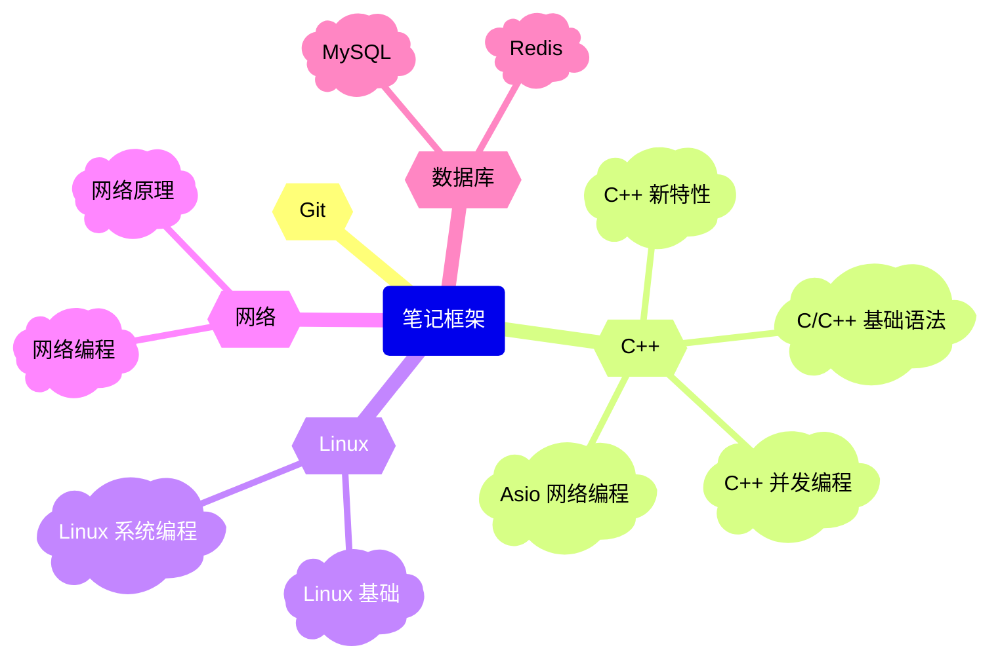

# 欢迎来到我的主页

写笔记的初衷是对自己学习过的知识点做一些简单的总结，人的忘性是难以避免的，即使写笔记是一件费时又耗力的事，但是通过笔记输出总结的方式可以进一步对知识点进行吸收和经验总结，也方便自己的日后查阅。在机缘巧合之下了解到 [MkDocs 工具](https://www.mkdocs.org/)，可以生成静态文档，再通过 Github Page 部署静态文档，即可完成简单的博客部署（此工具可以支持在所有的博客中索引查找指定的内容），本人的学习笔记通过这种方式进行部署。

## 笔记框架

## 打赏赞助

  

    
    
支付宝

  

  

    
    
微信

  

