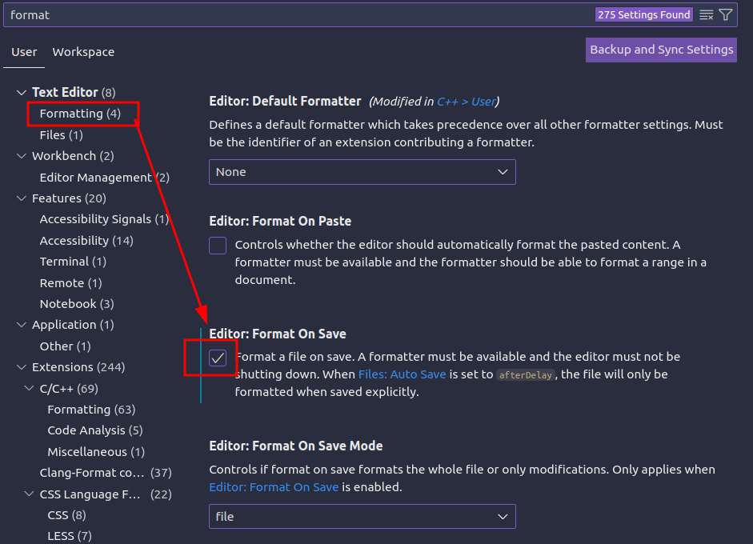
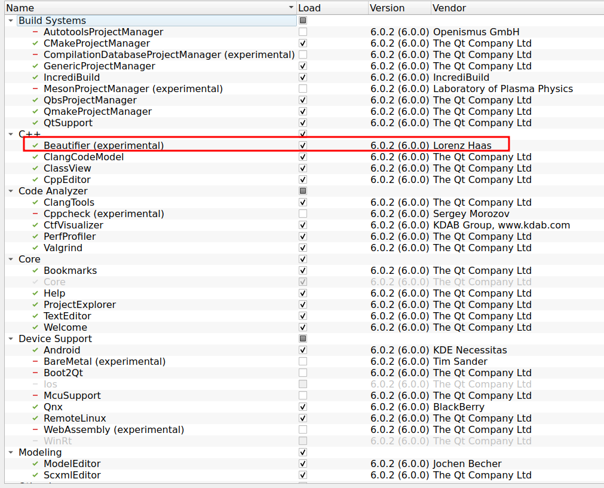
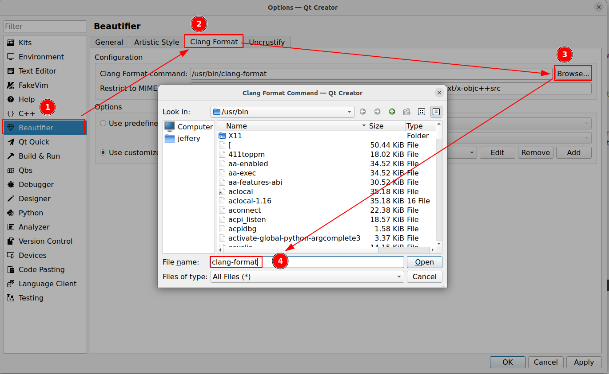
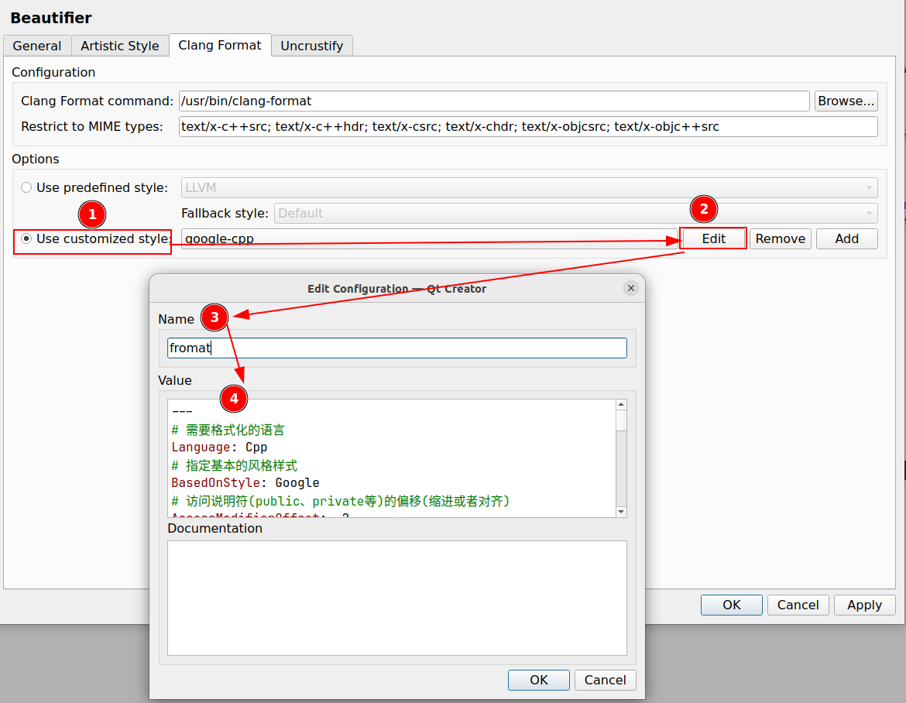

# clang-format 的使用

clang-format 是一个由 Clang 项目提供的自动化代码格式化工具，支持多种编程语言，特别是 C、C++、Java、JavaScript、Objective-C、Protobuf 等。它通过预设的规则或用户自定义的配置文件来格式化源代码，使代码的风格一致，提高代码的可读性和维护性。

## 安装方式

=== "Ubuntu 安装"

    ```bash
    sudo apt-get install clang-format
    ```

=== "Windows 安装"

    下载方式有很多种，最新版本需要在 LLVM 下载界面进行下载，下载地址是 [LLVM Downloda Page](https://releases.llvm.org/download.html)

## IDE 配置 clang-format

### VS Code

首先需要在 Vs Code 中安装 clang-format 插件，然后将 `.clang-format` 文件存放在工作区的根目录或项目的根目录。

在 Clang_format_style 中指定我们保存的 `.clang-format` 路径，这样我们就可以通过自己设置的 clang-format 进行格式化代码。

也可以在 settings 中搜索 format 配置保存自动格式化。



### Qt

- **安装插件**

打开帮助->关于插件->在 Beautifier 处打勾，然后重启 Qt Creator。



!!! note

    注意一定要重启 Qt Creator，Beautifier 插件才能生效。

- **配置 clang format**

打开 Qt Creator，点击工具->选项->Beautifier->Clang-format。点击浏览，会跳出一个文件窗口，找到 clang-format 的可执行文件，Qt Creator 就会自动填入 clang-format 文件的绝对路径。当然，你也可以选择手动输入 clang-format 可执行文件的绝对路径。



然后点击 Use customized style->Add，将自定义的 clang-format 赋值添加进去，最后点击 ok 并退出。



## 配置示例

```yaml
---
# 需要格式化的语言
Language: Cpp
# 指定基本的风格样式
BasedOnStyle: Google
# 访问说明符(public、private等)的偏移(缩进或者对齐)
AccessModifierOffset: -2
# 开括号(开圆括号、开尖括号、开方括号)后的对齐
AlignAfterOpenBracket: Align
# 对齐结构体数组
AlignArrayOfStructures: None
# 对齐连续赋值
AlignConsecutiveAssignments: None
# 位段对齐
AlignConsecutiveBitFields: None
# 连续声明对齐
AlignConsecutiveDeclarations: None
# 连续宏定义对齐
AlignConsecutiveMacros: true
# 对齐分割语法行的斜杠符 \
AlignEscapedNewlines: Left
# 竖直对齐表达式的操作数
AlignOperands:   Align
# 对齐尾部注释
AlignTrailingComments: true
# 允许参数在下一行上
AllowAllArgumentsOnNextLine: false
# 允许声明的参数在下一行上
AllowAllParametersOfDeclarationOnNextLine: false
# 允许短语法块在单行上
AllowShortBlocksOnASingleLine: Empty
# 允许短枚举在单行上
AllowShortEnumsOnASingleLine: false
# 允许短函数在单行上
AllowShortFunctionsOnASingleLine: Inline
# 允许 if 块在单行上
AllowShortIfStatementsOnASingleLine: Never
# 允许短匿 Lambda 函数在单行上
AllowShortLambdasOnASingleLine: Empty
# 允许合并短循环到单行上
AllowShortLoopsOnASingleLine: false
# 函数声明的返回类型换行风格
AlwaysBreakAfterReturnType: None
# 多行字符串断行
AlwaysBreakBeforeMultilineStrings: true
# 模板声明断行
AlwaysBreakTemplateDeclarations: Yes
# 装箱变量
BinPackArguments: true
# 装箱声明参数
BinPackParameters: true
# 位段列的空白风格
BitFieldColonSpacing: both
# 大括号断行风格
BreakBeforeBraces: Custom
# 大括号换行风格
BraceWrapping:
  AfterCaseLabel: false
  AfterClass: false
  AfterControlStatement: Never
  AfterEnum: false
  AfterFunction: false
  AfterNamespace: false
  AfterObjCDeclaration: false
  AfterStruct: false
  AfterUnion: false
  AfterExternBlock: false
  BeforeCatch: false
  BeforeElse: false
  IndentBraces: false
  SplitEmptyFunction: true
  SplitEmptyRecord: true
  SplitEmptyNamespace: true
# 二元操作符断行
BreakBeforeBinaryOperators: None
# 三元操作符断行规则
BreakBeforeTernaryOperators: false
# 构造初始化断行风格
BreakConstructorInitializersBeforeComma: true
# 允许每个构造函数的初始化列表成员单独放在一行中
ConstructorInitializerAllOnOneLineOrOnePerLine: true # 已废弃
# 确保构造函数的初始化列表不会合并成一行
PackConstructorInitializers: Never
# 继承链断行风格
BreakInheritanceList: AfterComma
# 字符串常量断行
BreakStringLiterals: true
# 列数限制
ColumnLimit: 120
# 紧凑命名空间
CompactNamespaces: false
# 构造初始化缩进宽度
ConstructorInitializerIndentWidth: 4
# 延续下一行的缩进宽度，只原来一行放不下时，换行后，新行缩进的字符数
ContinuationIndentWidth: 4
# 大括号列表风格
Cpp11BracedListStyle: false
# 提取行结尾
DeriveLineEnding: false # deprecated by LienEnding
# 提取指针对齐
DerivePointerAlignment: false
# 访问修饰符后空行
EmptyLineAfterAccessModifier: Never
# 访问修饰符前空行
EmptyLineBeforeAccessModifier: Always
# 修复命名空间描述
FixNamespaceComments: true
# include块风格
IncludeBlocks: Regroup
# include 种类
IncludeCategories:
  # C system headers
  - Regex: '<.*\.h>'
    Priority: 1
    CaseSensitive: true
  # C++ system headers
  - Regex: '<[a-z_]+>'
    Priority: 2
    CaseSensitive: true
  # Other package headers
  - Regex: '<.*>'
    Priority: 3
    CaseSensitive: true
  # Qt package headers
  - Regex: '<Q[^/]+>'
    Priority: 3
    CaseSensitive: true
  # Local package headers
  - Regex: '".*"'
    Priority: 4
    CaseSensitive: true
# 访问修饰符缩进
IndentAccessModifiers: false
# case 块缩进
IndentCaseBlocks: false
# case label 标签缩进
IndentCaseLabels: false
# Extern 扩展块缩进
IndentExternBlock: Indent
# 预处理指令缩进
IndentPPDirectives: None
# 缩进宽度
IndentWidth: 2
# 在语法块开始留空行
KeepEmptyLinesAtTheStartOfBlocks: false
# 指针对齐风格
PointerAlignment: Right
PenaltyBreakBeforeFirstCallParameter: 19
PenaltyBreakComment: 60
PenaltyBreakString: 1
PenaltyBreakFirstLessLess: 1000
PenaltyExcessCharacter: 1000
PenaltyReturnTypeOnItsOwnLine: 90
# 限定符对齐
QualifierAlignment: Custom
# 说明/限定符顺序
QualifierOrder: ['inline', 'static', 'const', 'volatile', 'type']
# 原始字符串格式
RawStringFormats:
  - Language:        Cpp
    Delimiters:
      - cc
      - CC
      - cpp
      - Cpp
      - CPP
      - 'c++'
      - 'C++'
    CanonicalDelimiter: ''
    BasedOnStyle:    google
  - Language:        TextProto
    Delimiters:
      - pb
      - PB
      - proto
      - PROTO
    EnclosingFunctions:
      - EqualsProto
      - EquivToProto
      - PARSE_PARTIAL_TEXT_PROTO
      - PARSE_TEST_PROTO
      - PARSE_TEXT_PROTO
      - ParseTextOrDie
      - ParseTextProtoOrDie
      - ParseTestProto
      - ParsePartialTestProto
    CanonicalDelimiter: pb
    BasedOnStyle:    google
# 引用对齐格式
ReferenceAlignment: Left
# 重排版注释
ReflowComments:  true
# 移除括号
RemoveBracesLLVM: false
# 分离定义语句块
SeparateDefinitionBlocks: Leave
# 短命名空间的行数
ShortNamespaceLines: 1
# 对 inclue 排序
SortIncludes:    CaseSensitive
# 对 using 声明排序
SortUsingDeclarations: true
# c 风格类型转换
SpaceAfterCStyleCast: false
# 逻辑 ! 操作符
SpaceAfterLogicalNot: false
# 模板关键字
SpaceAfterTemplateKeyword: true
# 赋值操作符空格
SpaceBeforeAssignmentOperators: true
# case 前空格
SpaceBeforeCaseColon: false
# 大括号列表空格
SpaceBeforeCpp11BracedList: false
# 构造器初始化冒号空格
SpaceBeforeCtorInitializerColon: true
# 继承冒号空格
SpaceBeforeInheritanceColon: true
# 圆括号空格
SpaceBeforeParens: ControlStatements
# 圆括号前空格控制
SpaceBeforeParensOptions:
  AfterControlStatements: true
  AfterForeachMacros: true
  AfterFunctionDefinitionName: false
  AfterFunctionDeclarationName: false
  AfterIfMacros:   true
  AfterOverloadedOperator: false
  BeforeNonEmptyParentheses: false
SpaceAroundPointerQualifiers: Default
# 循环范围里的冒号
SpaceBeforeRangeBasedForLoopColon: true
# 空块中的空格
SpaceInEmptyBlock: false
# 圆括号之间的空格
SpaceInEmptyParentheses: false
# 尾部注释之前的空格
SpacesBeforeTrailingComments: 2
# 角括号空白
SpacesInAngles:  Never
# 条件表达式中的空白
SpacesInConditionalStatement: false
# 容器中空格
SpacesInContainerLiterals: true
# cast 转换里的空格
SpacesInCStyleCastParentheses: false
# 行注释前缀空格
SpacesInLineCommentPrefix:
  Minimum:         1
  Maximum:         1
# 圆括号里面的空格
SpacesInParentheses: false
# 方括号之中的空白
SpacesInSquareBrackets: false
# 方括号前的空白
SpaceBeforeSquareBrackets: false
BitFieldColonSpacing: Both
# C++ 标准
Standard:        Auto
StatementAttributeLikeMacros:
  - Q_EMIT
StatementMacros:
  - Q_UNUSED
  - QT_REQUIRE_VERSION
# Tab 的宽度，替换为空白字符
TabWidth: 2
# 换行符种类, 换行时使用 \r\n 而不是 \n
UseCRLF:         false
# Tab 的使用
UseTab:          Never
# 对空白敏感且不应被触及的宏向量
WhitespaceSensitiveMacros:
  - STRINGIZE
  - PP_STRINGIZE
  - BOOST_PP_STRINGIZE
  - NS_SWIFT_NAME
  - CF_SWIFT_NAME
...
```

!!! info "参考文章"

    - [Clang-format 格式化及配置参数](https://blog.csdn.net/Once_day/article/details/127761573)